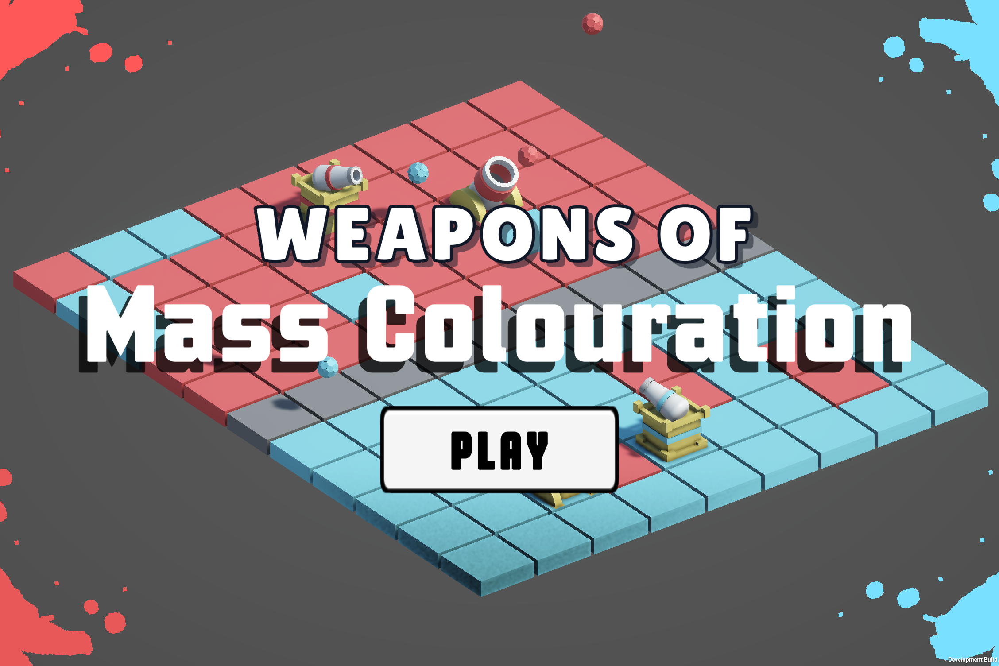
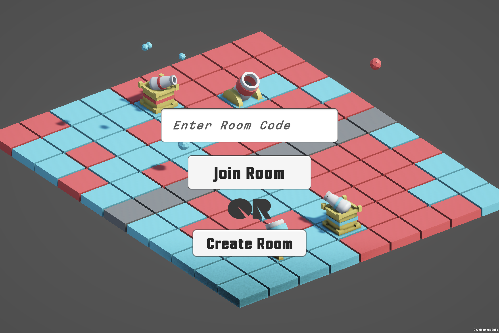

# Weapons Of Mass Colouration

Conquer the land with your colours!!

A **multiplayer** game where you face off an opponent and have to colour the ground in your colour using cannons, mortars and tesla towers in 90s!

**Play here:** https://irtaza.itch.io/weapons-of-mass-colouration

The game is built completely from scratch in Unity! All assets and 3d models have been made by us!!

## Demo Video

## Demo Images

## Controls

- Create a room, or join one using a code.
- Buy and place weapons onto your tiles, and try to colour the white tiles into your colour!
- Each tile you colour gives you 1 more coin, which you can use to buy even more **Weapons of Mass Colouration**!
- The player with the greator score after 90s wins!!

## Credits

Made by [Irtaza](https://github.com/Irtaza2009) and [Aayan](https://github.com/MuhammadAayanMirza)!

Our submission for **Thirdspace** week 2 and 3!
