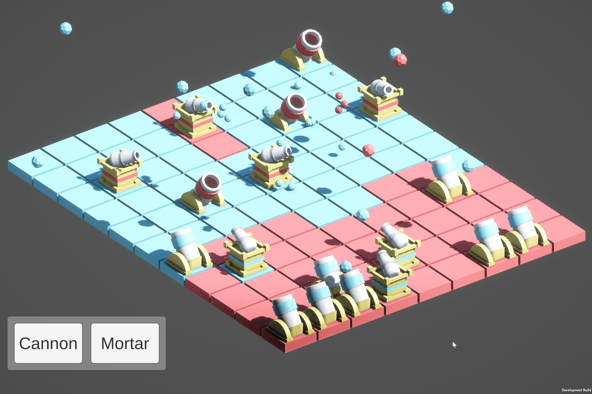

# Weapons Of Mass Colouration

Conquer the land with your colours!!

A **multiplayer** game where you face off an opponent and have to colour the ground in your colour using cannons and mortars!

**Play here:** https://irtaza.itch.io/weapons-of-mass-colouration

The game is built completely from scratch in Unity! All assets and 3d models have been made by us!!

## Demo Images

## Credits

Made by [Irtaza](https://github.com/Irtaza2009) and [Aayan](https://github.com/MuhammadAayanMirza)!

Our submission for **Thirdspace** week 2. We are also going to work on this next week too!
